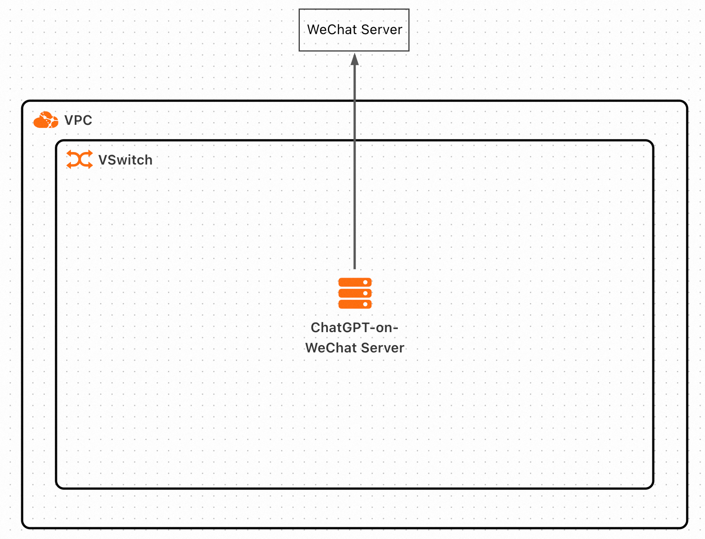
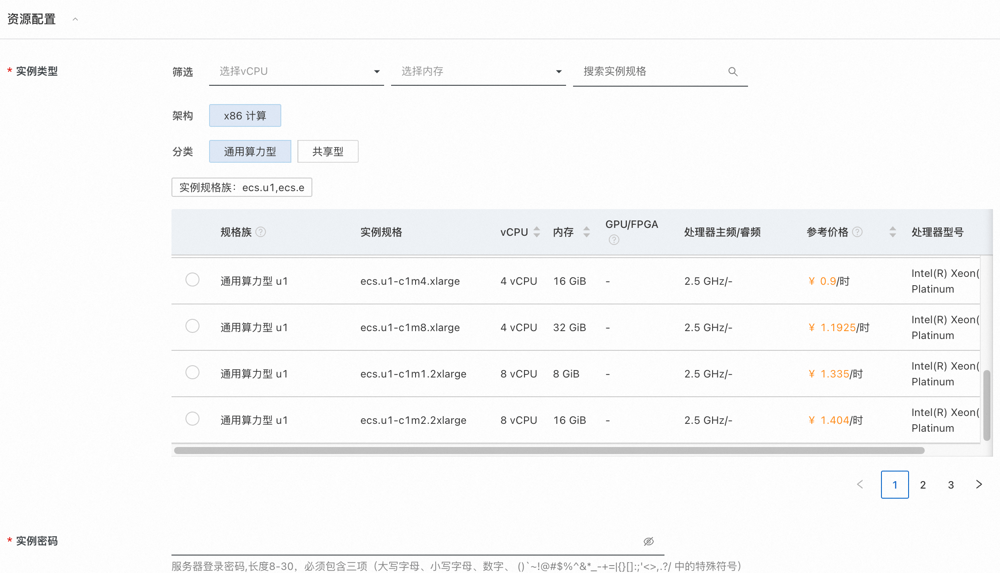
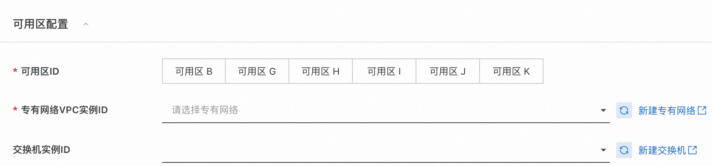
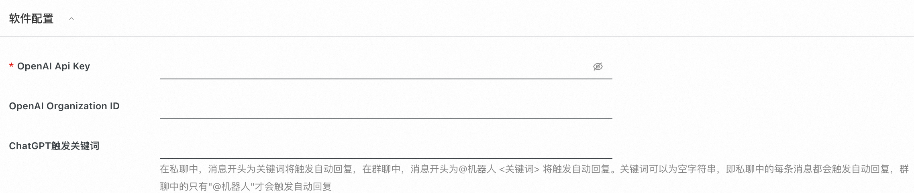
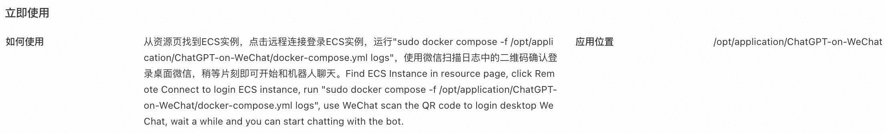
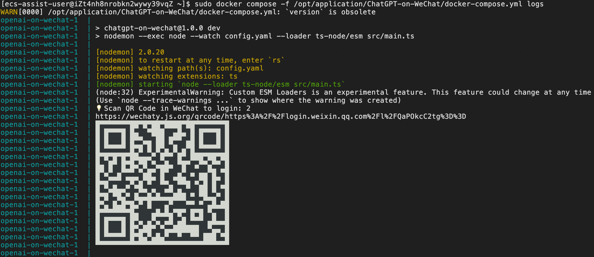

# ChatGPT-on-WeChat计算巢快速部署

>**免责声明**：本服务由第三方提供，我们尽力确保其安全性、准确性和可靠性，但无法保证其完全免于故障、中断、错误或攻击。因此，本公司在此声明：对于本服务的内容、准确性、完整性、可靠性、适用性以及及时性不作任何陈述、保证或承诺，不对您使用本服务所产生的任何直接或间接的损失或损害承担任何责任；对于您通过本服务访问的第三方网站、应用程序、产品和服务，不对其内容、准确性、完整性、可靠性、适用性以及及时性承担任何责任，您应自行承担使用后果产生的风险和责任；对于因您使用本服务而产生的任何损失、损害，包括但不限于直接损失、间接损失、利润损失、商誉损失、数据损失或其他经济损失，不承担任何责任，即使本公司事先已被告知可能存在此类损失或损害的可能性；我们保留不时修改本声明的权利，因此请您在使用本服务前定期检查本声明。如果您对本声明或本服务存在任何问题或疑问，请联系我们。

## 概述
ChatGPT-on-WeChat帮您两步在云端部署你的微信ChatGPT聊天机器人！
此项目的GitHub地址：[https://github.com/kx-Huang/ChatGPT-on-WeChat](https://github.com/kx-Huang/ChatGPT-on-WeChat)

## 前提条件
部署ChatGPT-on-WeChat社区版服务实例，需要对部分阿里云资源进行访问和创建操作。因此您的账号需要包含如下资源的权限。 **说明**：当您的账号是RAM账号时，才需要添加此权限。

| 权限策略名称 | 备注 |
| --- | --- |
| AliyunECSFullAccess | 管理云服务器服务（ECS）的权限 |
| AliyunVPCFullAccess | 管理专有网络（VPC）的权限 |
| AliyunROSFullAccess | 管理资源编排服务（ROS）的权限 |
| AliyunComputeNestUserFullAccess | 管理计算巢服务（ComputeNest）的用户侧权限 |

## 计费说明
ChatGPT-on-WeChat社区版在计算巢部署的费用主要涉及：

+ 所选vCPU与内存规格
+ 系统盘类型及容量
+ 公网带宽

此服务需要能够从ECS实例内访问公网的微信服务器。

## 部署架构
本服务部署在单台ECS实例上，架构如下：

## 参数说明
| 参数组 | 参数项 | 说明 |
| --- | --- | --- |
| 服务实例 | 服务实例名称 | 长度不超过64个字符，必须以英文字母开头，可包含数字、英文字母、短划线（-）和下划线（_） |
| | 地域 | 服务实例部署的地域 |
| | 付费类型 | 资源的计费类型：按量付费和包年包月 |
| 资源配置 | 实例类型 | 可用区下可以使用的实例规格 |
| | 实例密码 | 长度8-30，必须包含三项（大写字母、小写字母、数字、 ()`~!@#$%^&*-+=|{}[]:;'<>,.?/ 中的特殊符号） |
| 可用区配置 | 可用区 | ECS实例所在可用区 |
| | VPC ID | 资源所在VPC |
| | 交换机ID | 资源所在交换机 |
| 软件配置 | OpenAI Api key | OpenAI的Api key，必填 |
| | OpenAI Organization ID | OpenAI的Organization ID，可选 |
| | ChatGPT触发关键词 | 在私聊中，消息开头为关键词将触发自动回复，在群聊中，消息开头为@机器人 <关键词> 将触发自动回复。关键词可以为空字符串，即私聊中的每条消息都会触发自动回复，群聊中的只有"@机器人"才会触发自动回复 |

## 部署流程
1. 访问计算巢ChatGPT-on-WeChat[部署链接](https://computenest.console.aliyun.com/service/instance/create/default?type=user&ServiceName=ChatGPT-on-WeChat社区版)，按提示填写部署参数
2. 选择付费类型
   
3. 填写实例参数
   
4. 填写可用区和网络参数
4. 填写软件配置参数并点击“下一步：确认订单”
5. 确认部署参数并查看预估价格后，点击立即创建，等待服务实例部署完成
5. 服务实例部署完成后，点击实例ID进入到详情界面
6. 根据“立即使用”中的说明，登录到ECS实例内部，查看应用日志
7. 扫描应用日志中输出的最新的二维码，确认登录桌面微信
8.  稍等几秒后即可和微信机器人聊天